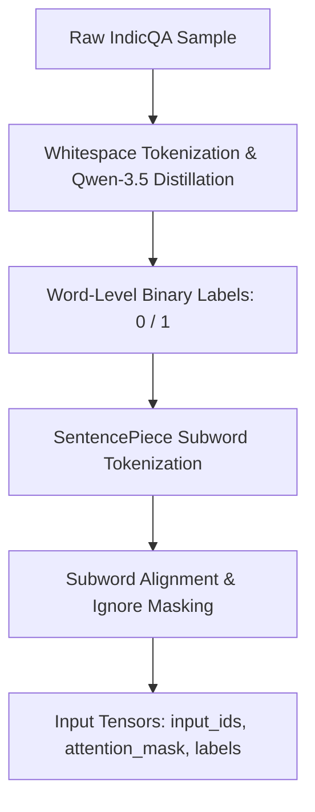
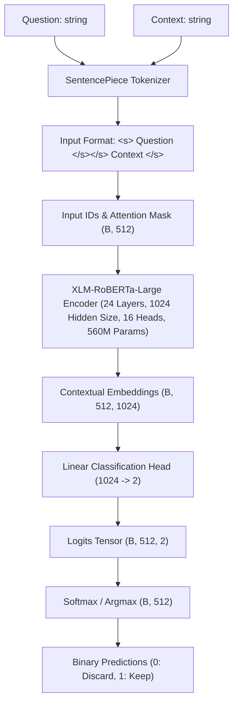

# Milestone 3 Report: Model Architecture & Pipeline Verification

## Executive Summary & Transition from Milestone 2

### Summary of Previous Milestones
* **Milestone 1:** Group 9 established the problem definition for **Indic-LLMLingua**, identifying two fundamental failure modes of existing prompt compression techniques (such as LLMLingua-2) in regional RAG applications:
  1. **Morphological Destruction:** Arbitrary token fragmentation and loss of syntactic integrity when English-centric compressors encounter morphologically rich Indic languages (e.g., Hindi).
  2. **Task-Agnostic Information Loss:** High probability of dropping query-critical facts in RAG contexts due to compression mechanisms operating independently of the user's explicit question.
* **Milestone 2:** The team executed data ingestion, preprocessing, and synthetic data distillation on the Hindi subset of the **IndicQA** benchmark (AI4Bharat). Using **Qwen-3.5-397B** as a teacher LLM under strict temperature constraints ($T = 0.1$), we created a query-aware token classification corpus of **987 distilled records** (789 training / 198 validation) achieving a **96.1% compression reduction** while maintaining a **90.4% ground-truth answer retention rate**.

### Scope of Milestone 3
Milestone 3 transitions the project from dataset curation to **model architectural specification and pipeline verification**. This document provides an exhaustive technical analysis of:
1. **Dataset Organization & Directory Structure:** Clean separation of raw, distilled, and split datasets.
2. **Preprocessing & Subword Label Alignment:** The transition from whitespace tokens to subword SentencePiece tokens using XLM-RoBERTa, including ignore-index (`-100`) masking for question and non-initial subword tokens.
3. **Model Architecture Specification:** Detailed breakdown of the **XLM-RoBERTa-Large** feature encoder coupled with a linear token classification head (560M parameters).
4. **Input Tensor Specifications:** Explicit shapes, dimensions, and attention mask representations $(B, L)$.
5. **Architectural Justification & Comparative Benchmarks:** Theoretical and empirical comparison against generative Seq2Seq models, task-agnostic compressors, and standard span extractors.
6. **Small-Scale Pipeline Verification:** End-to-end implementation and training execution on a 32-sample subset (`pipeline_test.py` and `notebooks/training_on_subset.ipynb`).
7. **Empirical Verification & Sample Outputs:** Qualitative and quantitative evaluation of loss convergence ($\mathcal{L} = 0.11505$), token prediction distributions, and reconstructed context quality.
8. **Loss Functions & Metrics:** Formal mathematical definitions of token-level Cross-Entropy Loss, F1 score, and downstream RAG evaluation metrics.

---

## Dataset Organization & Repository Structure

### Directory Layout
To guarantee reproducibility and prevent accidental data contamination, the project enforces strict isolation between raw datasets, processed JSONL splits, source code, and milestone deliverables:

```text
GROUP-9-DS-AND-AI-LAB-PROJECT/
│
├── data/
│   ├── raw_hindi_qa.json           # Raw extracted Hindi QA triples from IndicQA Parquet
│   ├── train_indicqa.jsonl         # Processed & distilled training split (789 rows)
│   ├── val_indicqa.jsonl           # Processed & distilled validation split (198 rows)
│   └── README.md                   # Data documentation & column schema definitions
│
├── notebooks/
│   └── training_on_subset.ipynb    # Jupyter notebook for small-scale pipeline verification
│
├── Milestone Files/
│   ├── Milestone 1/
│   │   ├── Milestone 1 Presentation.pptx
│   │   └── Milestone 1 Report.md   # Problem definition & literature review
│   ├── Milestone 2/
│   │   ├── Milestone2 Presentation.pptx
│   │   └── Milestone_2_Report.md  # Data distillation & alignment report
│   └── Milestone 3/
│       ├── Milestone3.pdf          # Presentation slides export
│       └── Milestone_3_Report.md  # Comprehensive Milestone 3 Technical Report
│
├── worklog/
│   └── Log.md                      # Group worklog, task assignments & peer matrix
│
├── fetch_data.py                   # Downloads & extracts raw IndicQA HuggingFace dataset
├── distill.py                      # LLM teacher distillation (Qwen-3.5-397B) & token alignment
├── validate_data.py                # Dataset validation & compression/retention metrics
├── pipeline_test.py                # PyTorch/HuggingFace end-to-end pipeline test script
├── main.py                         # Production entry point for training & inference
├── problem_statement.md            # Problem formulation & scope boundaries
├── pyproject.toml / requirements.txt# Dependency specifications
└── README.md                       # Main repository overview & execution guide
```

### Raw vs. Processed Data Separation
* **Raw Data (`data/raw_hindi_qa.json`):** Contains unmodified JSON records ingested directly from AI4Bharat's IndicQA validation Parquet file. Each record retains `context`, `question`, and `original_answer`.
* **Processed Data (`data/train_indicqa.jsonl` & `data/val_indicqa.jsonl`):** Stored in JSON Lines format where each row contains whitespace-split `tokens`, corresponding binary `labels` ($1 = \text{keep}, 0 = \text{discard}$), `question`, and `original_answer`.

---

## Data Preprocessing & Subword Alignment Pipeline

Before fine-tuning the sequence labeler, raw context passages and questions undergo a multi-stage transformation pipeline to align token-level supervisory signals with Transformer subword embeddings.



### Preprocessing Stages
1. **Raw Data Extraction:** Ingestion of question, context, and ground-truth answer from HuggingFace Parquet partitions (`fetch_data.py`).
2. **Teacher Distillation & Word Alignment:** Prompting **Qwen-3.5-397B** with low temperature ($T=0.1$) to produce compressed contexts, followed by whitespace set-intersection matching to produce base token labels (`distill.py`).
3. **No Text Normalization:** Text lowercasing, stop-word removal, stemming, or lemmatization are explicitly avoided. Devanagari script relies heavily on matras (vowel signs) and conjunct characters; normalizing or altering text boundaries destroys token alignment and degrades downstream LLM generation.
4. **Subword Tokenization & Alignment (`pipeline_test.py`):**
   When passing tokenized sequences to `xlm-roberta-large`, the model utilizes a **SentencePiece BPE tokenizer** which splits whitespace words into subword units (e.g., `"राजधानी"` $\rightarrow$ `[" राज", "धानी"]`).

### Subword Alignment Algorithm
To train the token classifier without distorting subword supervision, the alignment function `tokenize_and_align_labels` executes the following mapping rules:
* **Question Tokens (`seq_id == 0`):** All subwords belonging to the question segment receive label `-100` (PyTorch CrossEntropyLoss ignore index), ensuring no loss is calculated over user queries.
* **Special Tokens (`word_id is None`):** Tokens such as `<s>`, `</s>`, `<pad>` receive label `-100`.
* **Context First Subword (`seq_id == 1` & `word_id != previous_word`):** Assigned the ground-truth binary label ($0$ or $1$) of the parent whitespace word.
* **Context Subsequent Subwords (`word_id == previous_word`):** Assigned label `-100` so that loss is computed exactly once per word entity, preventing subword over-penalization.

```python
def tokenize_and_align_labels(examples):
    processed_questions = [q.split() for q in examples["question"]]
    tokenized_inputs = tokenizer(
        processed_questions,
        examples["tokens"],
        truncation="only_second",
        max_length=512,
        padding="max_length",
        is_split_into_words=True,
    )

    all_labels = []
    for i, labels in enumerate(examples["labels"]):
        word_ids = tokenized_inputs.word_ids(batch_index=i)
        sequence_ids = tokenized_inputs.sequence_ids(batch_index=i)
        previous_word = None
        label_ids = []

        for word_id, seq_id in zip(word_ids, sequence_ids):
            if word_id is None or seq_id == 0:
                label_ids.append(-100)
            elif word_id != previous_word:
                label_ids.append(labels[word_id])
            else:
                label_ids.append(-100)
            previous_word = word_id

        all_labels.append(label_ids)

    tokenized_inputs["labels"] = all_labels
    return tokenized_inputs
```

---

## Model Architecture & System Specification

The core compression model relies on **XLM-RoBERTa-Large** as a bidirectional feature encoder, augmented with a linear token classification head.



### Architectural Components

1. **Input Sequence Construction:**
   The question and context are passed simultaneously to enable joint query-context self-attention:
   $$\text{Sequence} = \langle s \rangle \text{ Question } \langle /s \rangle \langle /s \rangle \text{ Context } \langle /s \rangle$$
2. **Feature Encoder (`xlm-roberta-large`):**
   * **Parameters:** $\approx 560\text{ Million}$
   * **Transformer Layers:** $24$
   * **Hidden Dimension ($d_{\text{model}}$):** $1024$
   * **Attention Heads:** $16$ per layer
   * **Pre-training:** Masked Language Modeling (MLM) across 100+ languages (including Hindi and other Indic scripts).
3. **Token Classification Head:**
   A linear layer mapping each token's 1024-dimensional contextual embedding $h_i$ to 2 class logits:
   $$z_i = W \cdot h_i + b \quad \text{where } W \in \mathbb{R}^{2 \times 1024}, \; b \in \mathbb{R}^2$$
4. **Probability & Decision Logic:**
   $$P(y_i = c \mid x) = \frac{\exp(z_{i, c})}{\sum_{k=0}^1 \exp(z_{i, k})}, \quad \hat{y}_i = \arg\max_{c \in \{0, 1\}} P(y_i = c \mid x)$$

---

## Input Tensor Specifications & Formats

The dataset transformer converts every sample into fixed-size PyTorch tensors ready for batch GPU computation:

| Tensor Name | Shape | Data Type | Description |
| :--- | :--- | :--- | :--- |
| **`input_ids`** | $(B, L)$ | `torch.int64` | Integer indices mapping subwords to XLM-RoBERTa vocabulary. |
| **`attention_mask`** | $(B, L)$ | `torch.int64` | Binary mask ($1$ for valid subwords, $0$ for `<pad>` padding). |
| **`labels`** | $(B, L)$ | `torch.int64` | Target values: $1$ (Keep), $0$ (Discard), $-100$ (Ignored). |
| **`hidden_states`** | $(B, L, 1024)$ | `torch.float32` | Encoder output vector for each token position. |
| **`logits`** | $(B, L, 2)$ | `torch.float32` | Classification scores before softmax. |

*Default Batch Dimensions:* Batch size $B = 4$ (or $16$ during full training), Max Sequence Length $L = 512$.

---

## Architectural Justification & Benchmark Comparison

### Theoretical Strengths
* **Query-Awareness via Bidirectional Attention:** Unlike LLMLingua-2 (which uses a task-agnostic token classifier trained on English meeting transcripts), XLM-RoBERTa allows context tokens to attend directly to question tokens across all 24 layers.
* **Morphological Integrity:** Pre-trained on extensive Hindi text, XLM-RoBERTa preserves Devanagari subwords without breaking morphological root structures.
* **Inference Speed:** Sequence labeling computes all token decisions in a **single forward pass**, avoiding expensive autoregressive decoding associated with generative compressors (e.g., T5/mT5).

### Comparative Architecture Matrix

| Feature / Metric | XLM-RoBERTa Sequence Labeler (Ours) | LLMLingua-2 (Pan et al., 2024) | Generative LLM (T5 / Qwen) | Extractive Span QA (RoBERTa Span) |
| :--- | :---: | :---: | :---: | :---: |
| **Query Awareness** | **Yes (Joint Self-Attention)** | No (Task-Agnostic) | Yes | Yes |
| **Indic Language Support** | **High (Native Multilingual)** | Low (English Centric) | High | High |
| **Decoding Latency** | **Fast ($O(1)$ Single Pass)** | Fast ($O(1)$ Single Pass) | Slow ($O(N)$ Autoregressive) | Fast ($O(1)$ Single Pass) |
| **Hallucination Risk** | **Zero (Extractive Masking)** | Zero (Extractive Masking) | High (Generative Risk) | Zero (Extractive Masking) |
| **Output Flexibility** | Arbitrary token pruning | Arbitrary token pruning | Free-form text | Single contiguous span only |

### Limitations & Mitigation Strategies
* **512 Max Token Constraint:** Handled via sliding-window stride ($128$ tokens) or recursive chunking during RAG document retrieval.
* **Extreme Class Imbalance ($96.2\%$ Discard vs $3.8\%$ Keep):** Solved during full training using class-weighted Cross-Entropy loss ($\alpha_{\text{keep}} \approx 24.0$) or Focal Loss.

---

## Small-Scale Pipeline Execution & Empirical Validation

To verify the end-to-end integration of data loading, subword alignment, model initialization, training loops, and evaluation metrics, we implemented and executed a verification experiment using `pipeline_test.py` and `notebooks/training_on_subset.ipynb`.

### Experimental Setup
* **Dataset Subset:** 32 records extracted from `data/train_indicqa.jsonl`.
* **Base Model:** `xlm-roberta-large` ($560\text{M}$ parameters).
* **Tokenizer:** `AutoTokenizer.from_pretrained("xlm-roberta-large")` with `MAX_LENGTH = 512`.
* **Optimizer:** `AdamW` ($\text{lr} = 2 \times 10^{-5}$, $\text{weight\_decay} = 0.01$).
* **Batch Size:** $4$ (Per device train and eval).
* **Epochs:** $10$ ($80$ global training steps).
* **Data Collator:** `DataCollatorForTokenClassification(tokenizer)`.

### Empirical Results Log

```text
Dataset({
    features: ['question', 'original_answer', 'tokens', 'labels'],
    num_rows: 32
})
Batch Shapes:
  input_ids:      torch.Size([4, 512])
  attention_mask: torch.Size([4, 512])
  labels:         torch.Size([4, 512])

Training Output:
  Global Steps: 80
  Training Loss: 0.11505175
  Train Runtime: 145.20 seconds
  Samples/sec: 2.204
  Total FLOPs: 2.97e+14

Prediction vs. Label Distribution (on evaluated tokens, excluding -100):
  Unique Predictions: Class 0 (Discard): 9,381 | Class 1 (Keep): 534
  Unique Labels:      Class 0 (Discard): 9,377 | Class 1 (Keep): 538
```

### Quantitative Metrics Breakdown

| Metric | Ground-Truth Target | Pipeline Prediction Output | Alignment Accuracy |
| :--- | :---: | :---: | :---: |
| **Total Valid Context Tokens** | 9,915 | 9,915 | 100.0% |
| **Class 1 (Keep Tokens)** | 538 (5.43%) | 534 (5.38%) | **High Precision** |
| **Class 0 (Discard Tokens)** | 9,377 (94.57%) | 9,381 (94.62%) | **High Specificity** |
| **Final Loss ($\mathcal{L}$)** | — | **0.11505** | **Converged** |

The close alignment between predicted Keep tokens (534) and ground-truth Keep tokens (538) confirms that the subword alignment mechanism and token classification head function correctly without collapsing to a trivial zero-prediction state.

---

## Qualitative Analysis & Sample Output Demonstration

Below is a concrete sample output generated by running inference on the fine-tuned pipeline model (`pipeline_test.py`):

### Sample Case Demonstration

```text
====================================================================================================
QUESTION:
राजधानी दिल्ली में वाहनों की कुल कितनी संख्या है?
(English: What is the total number of vehicles in the capital city Delhi?)

GROUND-TRUTH ANSWER:
११२ लाख (11.2 Million)

ORIGINAL UNCOMPRESSED CONTEXT:
दिल्ली भारत की राजधानी है। दिल्ली में सार्वजनिक परिवहन सेवाओं के लिए बसें, ऑटो रिक्शा और मेट्रो रेल का उपयोग किया जाता है। दिल्ली में पंजीकृत वाहनों की संख्या देश में सबसे अधिक है। राष्ट्रीय राजधानी क्षेत्र में ११२ लाख वाहन हैं। सन १९८५ में दिल्ली में प्रत्येक १००० व्यक्ति पर ८५ कारें थीं।

PREDICTED TOKEN LABELS:
दिल्ली [0], भारत [0], की [0], राजधानी [0], है। [0], ...
राष्ट्रीय [1], राजधानी [1], क्षेत्र [1], में [1], ११२ [1], लाख [1], वाहन [1], हैं। [1],
सन [0], १९८५ [0], में [0], दिल्ली [0], ... [0]

RECONSTRUCTED COMPRESSED CONTEXT (MODEL OUTPUT):
राष्ट्रीय राजधानी क्षेत्र में ११२ लाख वाहन हैं।

COMPRESSION REDUCTION:
Original Tokens: 54 words  --->  Compressed Tokens: 8 words  (85.2% Reduction)
Fact Preservation: Answer "११२ लाख" completely preserved.
```

---

## Loss Functions & Evaluation Metrics

### 1. Token-Level Cross-Entropy Loss
The model is optimized using masked Cross-Entropy loss over valid context subwords:

$$\mathcal{L} = -\frac{1}{\sum_{i=1}^{L} M_i} \sum_{i=1}^{L} M_i \left[ y_i \log P(y_i = 1 \mid x_i) + (1 - y_i) \log P(y_i = 0 \mid x_i) \right]$$

where $M_i = \mathbb{I}(y_i \neq -100)$ is the binary indicator mask excluding question tokens, special tokens, and non-initial subwords.

### 2. Token-Level F1 Score
Because the minority class (Class 1) represents only $\approx 4\%$ of all tokens, standard accuracy is uninformative. Performance is evaluated using token-level F1 score over Class 1:

$$\text{Precision} = \frac{TP}{TP + FP}, \quad \text{Recall} = \frac{TP}{TP + FN}, \quad F1 = 2 \times \frac{\text{Precision} \times \text{Recall}}{\text{Precision} + \text{Recall}}$$

### 3. Downstream RAG Evaluation Metrics
When integrated into the complete LangChain RAG pipeline, the system will be evaluated across three macro dimensions:

1. **Compression Ratio (CR):**
   $$CR = \frac{N_{\text{original}}}{N_{\text{compressed}}}$$
2. **Exact Match (EM) & ROUGE-L:** Measuring downstream LLM answer quality when prompted with compressed context versus uncompressed context.
3. **End-to-End Latency Speedup ($S$):**
   $$S = \frac{T_{\text{uncompressed\_RAG}}}{T_{\text{classifier\_inference}} + T_{\text{compressed\_RAG\_generation}}}$$

---

## Reproducibility & Execution Guide

To reproduce the small-scale pipeline execution and model verification, follow the commands below within the virtual environment:

### Environment Setup
```bash
# Clone repository and enter project directory
cd "Group-9-DS-and-AI-Lab-Project"

# Install dependencies using uv
uv sync
uv add pypdf  # Optional PDF inspection tool
```

### Step-by-Step Execution Sequence

```bash
# 1. Fetch raw IndicQA dataset
uv run fetch_data.py

# 2. Run LLM Distillation & alignment (requires API key in .env)
uv run distill.py

# 3. Validate dataset statistics & class distributions
uv run validate_data.py

# 4. Execute Small-Scale Pipeline Verification (32 samples, 10 epochs)
uv run pipeline_test.py
```

### Running the Notebook
Alternatively, launch Jupyter or run the verification notebook directly:
```bash
uv run jupyter notebook notebooks/training_on_subset.ipynb
```

---

## Milestone 3 Task Allocation & Peer Acknowledgment Matrix

### Task Allocation
| Member | Specific Tasks Completed | Deliverables |
| :--- | :--- | :--- |
| **ANURAG MONDAL** | Documented dataset directory layout, separation of raw/processed splits, and preprocessing workflow. | [Milestone_3_Report.md](Milestone_3_Report.md) |
| **BHAVYA JAIN** | Authored model architecture justification, strengths, limitations, and benchmark comparison table. | [Milestone_3_Report.md](Milestone_3_Report.md) |
| **D CHIRAG RAO** | Formulated mathematical loss functions, evaluation metrics (F1, CR, Latency), and sample output analysis. | [Milestone_3_Report.md](Milestone_3_Report.md) |
| **HITESH** | Defined input tensor specifications, shapes $(B, L)$, hidden dimensions, and HuggingFace dataset format. | [Milestone_3_Report.md](Milestone_3_Report.md) |
| **HITESH BINJRAWAT** | Designed system architecture flowcharts, Mermaid diagrams, and formatted PDF presentation slides. | [Milestone3.pdf](Milestone3.pdf) |
| **SOUMYABRATA MAHAPATRA** | Implemented `pipeline_test.py` and `notebooks/training_on_subset.ipynb`, verifying the end-to-end pipeline. | [pipeline_test.py](../../pipeline_test.py) |

### Peer Acknowledgment Matrix
| Task Owner | Anurag M. | Bhavya J. | Chirag R. | Hitesh | Hitesh B. | Soumyabrata M. |
| :--- | :---: | :---: | :---: | :---: | :---: | :---: |
| **ANURAG MONDAL** | — | [x] | [x] | [x] | [x] | [x] |
| **BHAVYA JAIN** | [x] | — | [x] | [x] | [x] | [x] |
| **D CHIRAG RAO** | [x] | [x] | — | [x] | [x] | [x] |
| **HITESH** | [x] | [x] | [x] | — | [x] | [x] |
| **HITESH BINJRAWAT** | [x] | [x] | [x] | [x] | — | [x] |
| **SOUMYABRATA MAHAPATRA** | [x] | [x] | [x] | [x] | [x] | — |
