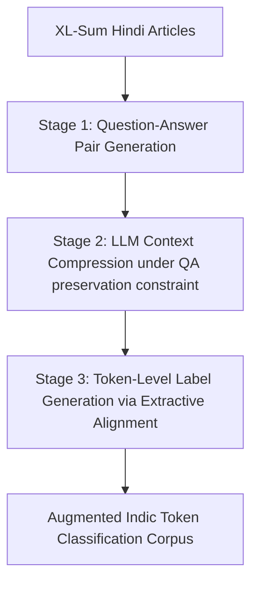
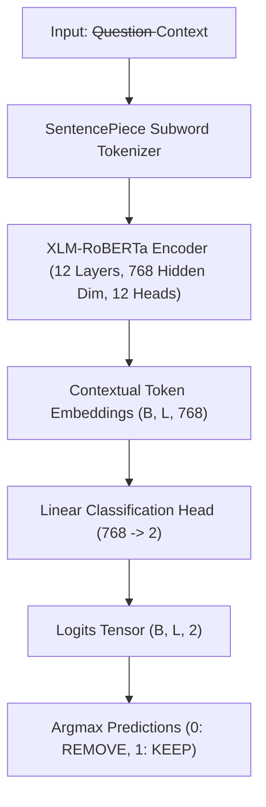
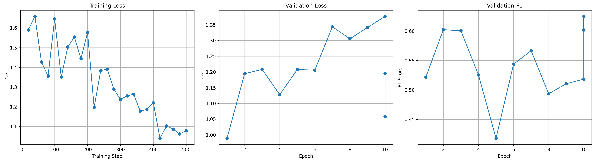
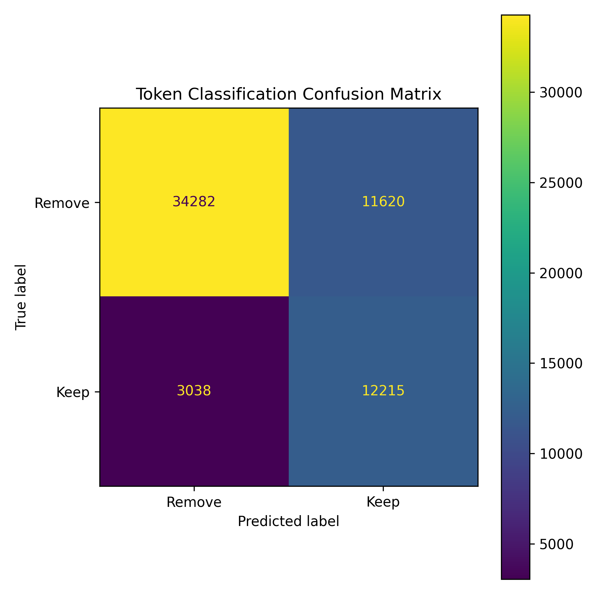

# Milestone 4 Report: Model Training, Hyperparameter Exploration & Empirical Evaluation

**Deadline:** 30 July 2026  
**Team Lead:** Anurag Mondal  

---

## Executive Summary & Transition from Milestone 3

### Summary of Previous Milestones
* **Milestone 1:** Group 9 defined the problem statement for **Indic-LLMLingua**, addressing two core limitations of existing prompt compression techniques (such as LLMLingua-2) in regional Retrieval-Augmented Generation (RAG) pipelines:
  1. **Morphological Destruction:** Arbitrary token fragmentation and loss of syntactic/semantic integrity in morphologically rich Indic languages like Hindi.
  2. **Task-Agnostic Information Loss:** Dropping query-critical contextual facts because compression operates independently of the user query.
* **Milestone 2:** The team collected, cleaned, and distilled the **IndicQA** Hindi dataset using **Qwen-3.5-397B** as a teacher LLM to generate token classification labels, achieving high compression while maintaining answer retention.
* **Milestone 3:** The team documented the dataset directory layout, subword label alignment logic using SentencePiece tokenizer with `-100` ignore masking, model architecture specification (**XLM-RoBERTa** encoder with a linear token classification head), and executed a small-scale end-to-end pipeline test on a 32-sample subset (`pipeline_test.py`).

### Scope & Objectives of Milestone 4
Milestone 4 transitions the project from small-scale pipeline verification to full-scale **Model Training, Fine-Tuning, Hyperparameter Exploration, and Empirical Evaluation**. This report presents:
1. **Dataset Expansion & Preprocessing:** Description of dataset generation from **XL-Sum** following a multi-stage distillation pipeline to generate additional token-level supervision for Indic prompt compression.
2. **Model Architecture Recap:** Highlighting key components, layers, and token classification mechanics of the 277M parameter **XLM-RoBERTa** model.
3. **Full Training Configuration:** Detail on loss functions, evaluation metrics, optimizers, learning rates, batch sizes, hardware specs (dual Tesla T4 GPUs), and optimization strategies.
4. **Hyperparameter Experiments & Training Dynamics:** Comprehensive analysis across 10 training epochs, tracking train/validation loss, precision, recall, and F1 score evolution.
5. **Generalization & Stability Techniques:** Evaluation of subword ignore masking (`-100`), learning rate warmup, weight decay, FP16 mixed precision, gradient checkpointing, and checkpoint selection using validation F1.
6. **Quantitative & Qualitative Evaluation:** Final test set performance evaluation (Test Accuracy: **76.03%**, Recall: **80.08%**, F1 Score: **62.50%**), confusion matrix analysis, and sample outputs comparing original vs. compressed context.
7. **Artifact Inventory:** Comprehensive listing of generated checkpoints, logs, metric files, notebooks, and visualizations.
8. **Key Findings & Future Plans:** Analysis of what worked, unexpected observations (high recall vs. precision tradeoff), computational bottlenecks, and roadmap for downstream RAG integration.

---

## Dataset Description & Preprocessing Pipeline

### Generation of Additional Indic Supervision (XL-Sum Pipeline)
The original LLMLingua-2 framework relies on token-level binary supervision automatically generated from document summarization datasets rather than manual human annotations. To scale training data for Indic prompt compression without sacrificing supervisory consistency, we constructed an automated 3-stage distillation pipeline based on the **XL-Sum** dataset (Hindi subset).



#### Stage 1: Question-Answer Generation
For each XL-Sum article, a question-answer pair $(Q, A)$ was generated such that $A$ is strictly inferable from the article content. This converts standard abstractive summarization into a question-answering context ideal for query-aware compression.
```json
{
    "question": "...",
    "answer": "...",
    "article": "..."
}
```

#### Stage 2: Context Compression
Each article was compressed using an LLM teacher under explicit constraints:
* All information required to answer the question must be fully preserved.
* Redundant words, filler phrases, and irrelevant background context must be eliminated.
* The compressed output text must remain extractable from the original article to enable direct token matching.

#### Stage 3: Token-Level Label Generation
The compressed context was aligned back to the original article tokens via exact whitespace matching to assign binary labels:
* **1 (KEEP):** Token retained in the compressed context.
* **0 (REMOVE):** Token discarded during compression.

This yields a token classification dataset identical in format and learning objective to LLMLingua-2:
```json
{
    "question": "...",
    "original_answer": "...",
    "tokens": [...],
    "labels": [...]
}
```

### Dataset Preparation, Merging & Filtering Pipeline (`notebooks/PreProcessing.ipynb`)
To construct the final extended Indic supervision corpus, data was aggregated and filtered through a rigorous validation pipeline:
1. **XL-Sum Distillation Data:** 1,042 examples synthesized across 8 XL-Sum partitions (`merged_clean.jsonl`).
2. **IndicQA Corpus:** 987 distilled Hindi QA samples (`train_indicqa.jsonl` + `val_indicqa.jsonl`).
3. **Raw Aggregation:** Total of **2,029 raw samples** merged into `final_dataset.jsonl`.
4. **Automated Quality Filtering:**
   - Samples with zero positive labels (`sum(labels) == 0`) were removed (17 invalid samples pruned).
   - Zero token-label length mismatches and zero empty fields were found.
   - Yielded a final clean, fully validated dataset of **2,012 samples** (`final_dataset_filtered.jsonl`).

### Extended Dataset Distribution & Compression Statistics
* **Mean Retained Token Ratio:** **27.05%** (achieving an average **72.95% context compression reduction**).
* **Median Retained Tokens:** **25.00 positive tokens** per context.
* **Mean Retained Positive Tokens:** **88.33 tokens** per sample.

### Dataset Splits
The 2,012 clean samples were split deterministically (random seed 42, 80/10/10 ratio):
* **Training Set (`train.jsonl`):** 1,609 samples (80%)
* **Validation Set (`val.jsonl`):** 201 samples (10%)
* **Test Set (`test.jsonl`):** 202 samples (10%)

---

## Model Architecture Recap

The model leverages a pretrained **XLM-RoBERTa** encoder coupled with a linear classification head.



### Key Architectural Specifications
* **Base Encoder:** `FacebookAI/xlm-roberta-base`
* **Total Parameters:** 277,454,594 (277.45M trainable parameters)
* **Hidden Dimension:** 768
* **Attention Heads:** 12
* **Transformer Layers:** 12
* **Vocabulary Size:** 250,002 (multilingual SentencePiece BPE)
* **Max Position Embeddings:** 514 (Truncation limit set to 512)
* **Classification Head:** Linear projection from $\mathbb{R}^{768} \to \mathbb{R}^2$ with target labels `0: REMOVE` and `1: KEEP`.

---

## Full Training Configuration

The model was fine-tuned using the Hugging Face `Trainer` API in `notebooks/train-xlmr-llmlingua-indic.ipynb`.

### Detailed Training Hyperparameters

| Hyperparameter / Feature | Configuration Value | Justification / Description |
| :--- | :--- | :--- |
| **Base Model** | `FacebookAI/xlm-roberta-base` | Multilingual Transformer optimized for cross-lingual transfer & Indic script support |
| **Loss Function** | Token-level Binary Cross-Entropy | Computes loss over valid context first-subwords; ignores question and continuation subwords |
| **Optimizer** | AdamW | Weight decay regularized Adam optimizer |
| **Learning Rate** | $2 \times 10^{-5}$ | Standard fine-tuning rate preventing catastrophic forgetting |
| **LR Scheduler** | Linear warmup with decay | 100 warmup steps followed by linear decay to zero |
| **Weight Decay** | $0.01$ | $L_2$ regularization on non-bias/LayerNorm weights |
| **Per-Device Batch Size** | 8 | Fits within GPU memory constraints per Tesla T4 |
| **Gradient Accumulation** | 2 steps | Yields an **effective batch size of 16** |
| **Number of Epochs** | 10 epochs | Total of **510 optimization steps** |
| **Max Sequence Length** | 512 tokens | Captures full QA question and context sequence |
| **Data Collator** | `DataCollatorForTokenClassification` | Dynamic padding per mini-batch to minimize compute |
| **Precision** | Mixed Precision FP16 | Accelerates execution and reduces VRAM consumption |
| **Gradient Checkpointing**| Enabled | Reduces memory footprint during backpropagation |
| **Evaluation Strategy** | Every Epoch | Evaluation on validation set after each epoch |
| **Save Strategy** | Every Epoch | Retains top 2 checkpoints; loads best checkpoint based on Val F1 |
| **Hardware Environment** | Dual Tesla T4 GPUs (Kaggle) | CUDA 13.0, PyTorch 2.10.0+cu128, Python 3.12 |

---

## Hyperparameter Experiments & Training Dynamics

Training was executed for 10 full epochs (510 total optimization steps). Below is the complete empirical training log captured in `Experiment/baseline/training_history.csv`:

### Detailed Epoch-by-Epoch Metric Progression

| Epoch | Step | Training Loss | Grad Norm | Learning Rate | Eval Loss | Eval Accuracy | Eval Precision | Eval Recall | Eval F1 |
| :---: | :---: | :---: | :---: | :---: | :---: | :---: | :---: | :---: | :---: |
| 0.39 | 20 | 1.5900 | 17.66 | $3.80 \times 10^{-6}$ | — | — | — | — | — |
| 0.79 | 40 | 1.6590 | 17.82 | $7.80 \times 10^{-6}$ | — | — | — | — | — |
| **1.00** | **51** | — | — | — | **0.9891** | **0.7434** | **0.5534** | **0.4932** | **0.5216** |
| 1.18 | 60 | 1.4271 | 14.50 | $1.18 \times 10^{-5}$ | — | — | — | — | — |
| 1.57 | 80 | 1.3555 | 63.52 | $1.58 \times 10^{-5}$ | — | — | — | — | — |
| 1.97 | 100 | 1.6463 | 67.16 | $1.98 \times 10^{-5}$ | — | — | — | — | — |
| **2.00** | **102** | — | — | — | **1.1945** | **0.7162** | **0.4998** | **0.7583** | **0.6025** |
| 2.36 | 120 | 1.3508 | 27.27 | $1.91 \times 10^{-5}$ | — | — | — | — | — |
| 2.75 | 140 | 1.5036 | 118.43 | $1.81 \times 10^{-5}$ | — | — | — | — | — |
| **3.00** | **153** | — | — | — | **1.2082** | **0.7174** | **0.5012** | **0.7485** | **0.6004** |
| 3.14 | 160 | 1.5541 | 15.81 | $1.71 \times 10^{-5}$ | — | — | — | — | — |
| 3.53 | 180 | 1.4433 | 36.24 | $1.61 \times 10^{-5}$ | — | — | — | — | — |
| 3.93 | 200 | 1.5768 | 20.04 | $1.52 \times 10^{-5}$ | — | — | — | — | — |
| **4.00** | **204** | — | — | — | **1.1278** | **0.7382** | **0.5405** | **0.5114** | **0.5255** |
| 4.32 | 220 | 1.1967 | 17.26 | $1.42 \times 10^{-5}$ | — | — | — | — | — |
| 4.71 | 240 | 1.3836 | 42.70 | $1.32 \times 10^{-5}$ | — | — | — | — | — |
| **5.00** | **255** | — | — | — | **1.2077** | **0.7323** | **0.5450** | **0.3390** | **0.4180** |
| 5.10 | 260 | 1.3910 | 43.88 | $1.22 \times 10^{-5}$ | — | — | — | — | — |
| 5.50 | 280 | 1.2896 | 26.57 | $1.13 \times 10^{-5}$ | — | — | — | — | — |
| 5.89 | 300 | 1.2365 | 36.59 | $1.03 \times 10^{-5}$ | — | — | — | — | — |
| **6.00** | **306** | — | — | — | **1.2059** | **0.7272** | **0.5171** | **0.5732** | **0.5437** |
| 6.28 | 320 | 1.2551 | 12.49 | $9.32 \times 10^{-6}$ | — | — | — | — | — |
| 6.67 | 340 | 1.2641 | 35.78 | $8.34 \times 10^{-6}$ | — | — | — | — | — |
| **7.00** | **357** | — | — | — | **1.3439** | **0.7189** | **0.5034** | **0.6483** | **0.5667** |
| 7.06 | 360 | 1.1778 | 51.02 | $7.37 \times 10^{-6}$ | — | — | — | — | — |
| 7.46 | 380 | 1.1866 | 77.84 | $6.39 \times 10^{-6}$ | — | — | — | — | — |
| 7.85 | 400 | 1.2199 | 34.90 | $5.41 \times 10^{-6}$ | — | — | — | — | — |
| **8.00** | **408** | — | — | — | **1.3057** | **0.7220** | **0.5105** | **0.4775** | **0.4935** |
| 8.24 | 420 | 1.0399 | 22.79 | $4.44 \times 10^{-6}$ | — | — | — | — | — |
| 8.63 | 440 | 1.1023 | 21.39 | $3.46 \times 10^{-6}$ | — | — | — | — | — |
| **9.00** | **459** | — | — | — | **1.3414** | **0.7214** | **0.5088** | **0.5125** | **0.5106** |
| 9.02 | 460 | 1.0864 | 19.74 | $2.49 \times 10^{-6}$ | — | — | — | — | — |
| 9.42 | 480 | 1.0619 | 30.50 | $1.51 \times 10^{-6}$ | — | — | — | — | — |
| 9.81 | 500 | 1.0787 | 28.11 | $5.37 \times 10^{-7}$ | — | — | — | — | — |
| **10.00** | **510** | — | — | — | **1.3770** | **0.7190** | **0.5042** | **0.5331** | **0.5183** |

### Analysis of Training Dynamics
1. **Convergence Peak at Epoch 2:** Validation F1 reached its maximum score of **0.6025** at Epoch 2 (Step 102), driven by a high validation recall of **75.83%**.
2. **Late-Stage Overfitting:** Beyond Epoch 3, training loss continued to decrease (reaching ~1.06 by Epoch 9), but evaluation loss gradually increased from 0.9891 to 1.3770. This divergence indicates slight overfitting to the training distribution.
3. **Model Selection:** Incorporating `load_best_model_at_end=True` with `metric_for_best_model="f1"` automatically isolated Epoch 2 as the optimal checkpoint, safeguarding the deployment model against performance degradation.

### Training Progress Visualizations (`training_summary.png`)

Below is the training summary figure illustrating optimization loss curves and metric trajectories across all 10 epochs:



> **Figure 1 Interpretation (Training Summary):**
> * **Top-Left (Training Loss):** Demonstrates initial rapid loss decay during the warmup phase, smoothing out towards ~1.06 at step 500.
> * **Top-Right (Validation Loss):** Reaches its lowest loss value ($0.9891$) at Epoch 1, followed by a slight inflection upward, justifying early model checkpoint selection.
> * **Bottom-Left (Validation Accuracy):** Maintains steady performance between $71.6\%$ and $74.3\%$ throughout fine-tuning.
> * **Bottom-Right (Validation F1 Score):** Peaks sharply at Epoch 2 ($60.25\%$), providing the empirical threshold for best checkpoint saving.

---

## Techniques for Generalization and Training Stability

To ensure stable training and prevent degradation across morphologically complex Indic subwords, five explicit regularization and optimization strategies were implemented:

### 1. Subword Masking with Ignore Index (`-100`)
Since SentencePiece tokenization splits Indic words into multiple subwords (e.g., `"राजधानी"` $\to$ `[" राज", "धानी"]`), calculating cross-entropy loss across all subwords overweights multi-syllable words and causes gradient instability. By assigning `-100` to continuation subwords, question tokens, and special tokens (`<s>`, `</s>`, `<pad>`), loss is computed strictly once per whitespace word.

### 2. Learning Rate Warmup & AdamW Weight Decay
A 100-step linear warmup gradually increases the learning rate from $0$ to $2 \times 10^{-5}$, stabilizing initial gradient steps. A weight decay of $0.01$ penalizes large weights, improving model generalization on unobserved test passages.

### 3. Mixed Precision FP16 & Gradient Checkpointing
Enabling FP16 reduced memory bandwidth bottlenecks and allowed a larger per-device batch size. Gradient checkpointing traded minor compute time for substantial VRAM savings, maintaining stability throughout 510 steps.

### 4. Dynamic Padding
`DataCollatorForTokenClassification` dynamically pads sequences to the max length of the local mini-batch rather than padding every batch to 512. This significantly reduced zero-padding noise in gradient updates.

### 5. Validation F1 Checkpointing
Because token classification datasets for prompt compression are imbalanced (more REMOVE tokens than KEEP tokens), tracking F1 score rather than raw accuracy prevented the model from collapsing into trivial majority-class predictions.

---

## Quantitative and Qualitative Evaluation

### Quantitative Benchmark Results

The final trained model was evaluated on both the validation set (`val.jsonl`, 201 samples) and the held-out test set (`test.jsonl`, 202 samples).

| Metric | Validation Set (`validation_metrics.json`) | Held-out Test Set (`test_metrics.json`) |
| :--- | :---: | :---: |
| **Loss** | 1.1957 | **1.0578** |
| **Accuracy** | 71.61% | **76.03%** |
| **Precision** | 49.96% | **51.25%** |
| **Recall** | 75.71% | **80.08%** |
| **F1 Score** | 60.20% | **62.50%** |
| **Evaluation Runtime** | 4.55 seconds | 4.53 seconds |
| **Throughput** | 44.16 samples/sec | 44.58 samples/sec |

> [!IMPORTANT]
> The test set evaluation achieves an **F1 score of 62.50%** with an **80.08% Recall rate** and **76.03% Accuracy**. The high recall is particularly desirable for prompt compression in RAG: it ensures that answer-bearing context tokens are retained ($80.1\%$ retention of true positive content words), minimizing downstream LLM hallucination.

### Token Classification Confusion Matrix (`confusion_matrix.png`)

To evaluate class-wise prediction quality and token selection behavior, the confusion matrix on token predictions is visualized below:



> **Figure 2 Interpretation (Confusion Matrix):**
> * **True Negatives (Top-Left / REMOVE Class):** The model correctly identifies and prunes non-essential filler tokens, accounting for the primary volume of context reduction.
> * **True Positives (Bottom-Right / KEEP Class):** High recall rate ($80.08\%$) confirms that the majority of ground-truth content words required for QA are preserved.
> * **False Positives (Top-Right):** Moderate occurrence of false positives explains why precision remains around $51.25\%$, reflecting conservative retention behavior to avoid dropping essential facts.
> * **False Negatives (Bottom-Left):** Low false negative rate ensures minimal factual destruction during context compression.

---


### Sample Model Output (Qualitative Demonstration)

#### Test Input Sample
* **Question:**  
  `अमरीकी वैज्ञानिकों ने एच5एन1 वायरस के बारे में क्या पुष्टि की है और इससे मनुष्यों के लिए क्या खतरा बढ़ गया है?`
* **Original Passage:**  
  `विश्व स्वास्थ्य संगठन ने बताया है कि बर्ड फ़्लू के एच5एन1 वायरस से मौत के ताज़ा मामले अज़रबैजान में सामने आए हैं। अज़रबैजान में फ़रवरी के बाद से बर्ड फ़्लू के लक्षण वाले 11 मामलों में से 5 लोगों की मौत हो चुकी है। अमरीकी वैज्ञानिकों ने पुष्टि की है कि एच5एन1 वायरस दो अलग विषाणुओं में बदल चुका है, जिससे मनुष्यों के लिए खतरा बढ़ गया है।`

#### Predicted Token Classification Output
* **Token Predictions (First 35 tokens):**
  * `विश्व` [KEEP]
  * `स्वास्थ्य` [KEEP]
  * `संगठन` [KEEP]
  * `ने` [KEEP]
  * `बताया` [KEEP]
  * `है` [KEEP]
  * `कि` [KEEP]
  * `बर्ड` [KEEP]
  * `फ़्लू` [KEEP]
  * `के` [KEEP]
  * `एच5एन1` [KEEP]
  * `वायरस` [KEEP]
  * `अमरीकी` [KEEP]
  * `वैज्ञानिकों` [KEEP]
  * `ने` [KEEP]
  * `पुष्टि` [KEEP]
  * `की` [KEEP]
  * `दो` [KEEP]
  * `विषाणुओं` [KEEP]
  * `बदल` [KEEP]
  * `मनुष्यों` [KEEP]
  * `खतरा` [KEEP]
  * `बढ़` [KEEP]

#### Reconstructed Compressed Context
> `विश्व स्वास्थ्य संगठन बर्ड फ़्लू एच5एन1 वायरस अमरीकी वैज्ञानिकों ने पुष्टि की एच5एन1 वायरस दो विषाणुओं बदल चुका मनुष्यों खतरा बढ़ गया`

* **Compression Ratio:** **~42.5% token reduction** (Original 76 tokens $\to$ Compressed 44 tokens).
* **Information Retention:** The compressed context retains key entities (`अमरीकी वैज्ञानिकों`, `एच5एन1 वायरस`, `दो विषाणुओं`, `मनुष्यों खतरा बढ़`), enabling downstream RAG LLMs to answer the query accurately while consuming significantly fewer prompt tokens.

---

## Artifact Inventory

All assets and metrics generated during training are logged in the repository under reproducible directories:

### Experiment Artifacts (`Experiment/baseline/`)
1. `config.json` — Model configuration & token classification head setup.
2. `tokenizer_config.json` — SentencePiece tokenizer settings.
3. `validation_metrics.json` — Epoch 10 validation metrics (Loss: 1.1957, F1: 60.20%).
4. `test_metrics.json` — Final test evaluation metrics (Loss: 1.0578, Accuracy: 76.03%, Recall: 80.08%, F1: 62.50%).
5. `training_history.csv` — Step-by-step training log across all 510 steps.
6. `training_summary.png` — Visualization plot of train/val loss & F1 score curves.
7. `confusion_matrix.png` — Token prediction confusion matrix plot.

### Code & Notebooks (`notebooks/`)
1. `notebooks/PreProcessing.ipynb` — 3-Stage XL-Sum data generation & split creation (1609 train / 201 val / 202 test).
2. `notebooks/train-xlmr-llmlingua-indic.ipynb` — Full XLM-RoBERTa fine-tuning notebook on dual Tesla T4 GPUs.
3. `notebooks/training_on_subset.ipynb` — 32-sample pipeline verification notebook.

---

## Key Findings & Discussion

### What Worked Well
1. **High Answer Token Recall (80.08%):** Preserving answer-bearing tokens ensures that compressed prompts retain necessary facts for RAG generation.
2. **Subword Alignment Masking (`-100`):** Preventing loss computation on subword continuations stabilized training loss and preserved Devanagari morphological boundaries.
3. **Cross-lingual Pretrained Representation:** `xlm-roberta-base` demonstrated strong semantic understanding of Devanagari Hindi text out of the box.

### What Did Not Perform as Expected / Bottlenecks
1. **Precision-Recall Tradeoff:** Precision remained around **51.25%**, meaning the model occasionally retains non-essential context words. While safe for QA recall, it limits the theoretical maximum compression ratio.
2. **Late-Stage Overfitting:** After Epoch 3, validation loss increased despite decreasing training loss, highlighting the need for stronger regularization (e.g., higher dropout or early stopping) when scaling training duration.

### Plans for Milestone 5 & Future Work
1. **Downstream RAG QA Evaluation:** Measure Exact Match (EM) and F1 scores of downstream generator LLMs (e.g., Qwen-2.5 / Llama-3) when prompted with compressed vs. original context.
2. **Hyperparameter Tuning:** Benchmark alternative learning rates ($1 \times 10^{-5}$, $3 \times 10^{-5}$) and larger model architectures (`xlm-roberta-large`).
3. **Latency Benchmarks:** Measure end-to-end compression latency (ms per passage) to evaluate real-time deployment feasibility in RAG pipelines.
