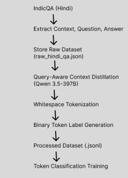
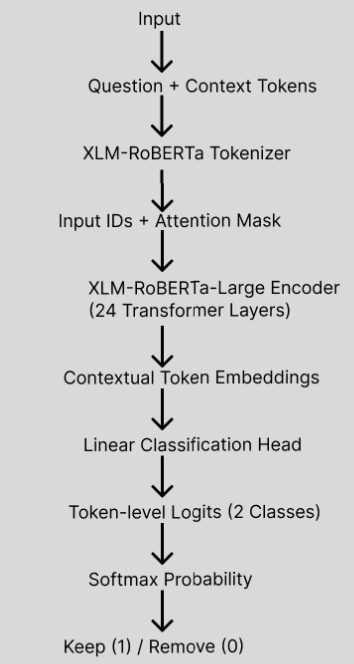

# Deployment Guide

This guide explains how to run and deploy the Query-Aware Prompt Compressor application.

The project contains:

1. A FastAPI backend
2. A static frontend served by the backend
3. Optional model inference support for prompt compression

## Project Layout

Relevant files:

1. [app/main.py](app/main.py) - FastAPI entrypoint
2. [frontend/index.html](frontend/index.html) - frontend UI
3. [requirements.txt](requirements.txt) - Python dependencies
4. [Dockerfile](Dockerfile) - container deployment
5. [render.yaml](render.yaml) - Render deployment config

## Prerequisites

Before running the app, make sure you have:

1. Python 3.11 or later installed
2. `pip` available
3. Internet access for first-time package installation

Optional for prediction support:

1. A fine-tuned Hugging Face token-classification model stored at `submission_artifacts/model`

Expected model directory contents:

1. `config.json`
2. `pytorch_model.bin` or `model.safetensors`
3. tokenizer files such as `tokenizer.json`, `tokenizer_config.json`, `special_tokens_map.json`

If the model folder is missing, the dashboard still works, but the prediction endpoint returns `503`.

## Local Deployment

### 1. Open the project folder

From PowerShell:

```powershell
cd C:/Users/z004tdax/Downloads/Group-9-DS-and-AI-Lab-Project-main/Group-9-DS-and-AI-Lab-Project-main
```

### 2. Install dependencies

```powershell
python -m pip install -r requirements.txt
```

### 3. Set environment variables

These are optional, but recommended.

```powershell
$env:APP_ENV="development"
$env:MODEL_DIR="submission_artifacts/model"
$env:DEVICE="cpu"
$env:MAX_LENGTH="512"
```

### 4. Start the server

```powershell
python -m uvicorn app.main:app --host 127.0.0.1 --port 8000 --reload
```

Use `127.0.0.1` or `localhost` in the browser. Do not open `0.0.0.0` in the browser.

### 5. Open the app

Frontend:

```text
http://localhost:8000/
```

Swagger docs:

```text
http://localhost:8000/docs
```

## Docker Deployment

### 1. Build the image

```powershell
docker build -t query-aware-prompt-compressor .
```

### 2. Run the container

```powershell
docker run --rm -p 8000:8000 ^
  -e APP_ENV=development ^
  -e MODEL_DIR=/app/submission_artifacts/model ^
  -e DEVICE=cpu ^
  -e MAX_LENGTH=512 ^
  query-aware-prompt-compressor
```

Then open:

```text
http://localhost:8000/
```

## Render Deployment

This repository already includes [render.yaml](render.yaml).

Configured values:

1. Build command: `pip install -r requirements.txt`
2. Start command: `uvicorn app.main:app --host 0.0.0.0 --port $PORT`
3. Model path: `/opt/render/project/src/submission_artifacts/model`

### Steps

1. Push the repository to GitHub.
2. Open Render.
3. Create a new Blueprint deployment from the repository.
4. Confirm the environment variables from [render.yaml](render.yaml).
5. Ensure the model files are available in `submission_artifacts/model` before deployment if you want `/api/predict` to work.

## Available Endpoints

The deployed app exposes:

1. `GET /api/health`
2. `GET /api/runs`
3. `GET /api/runs/{run_id}/metrics`
4. `GET /api/runs/{run_id}/history`
5. `GET /api/runs/{run_id}/artifacts`
6. `GET /api/runs/{run_id}/artifacts/{artifact_name}`
7. `POST /api/predict`

## Troubleshooting

### Page does not load

Check that the server is running:

```powershell
python -m uvicorn app.main:app --host 127.0.0.1 --port 8000 --reload
```

Then open:

```text
http://localhost:8000/
```

### Browser shows `ERR_ADDRESS_INVALID`

You likely opened `http://0.0.0.0:8000/`.

Use:

1. `http://localhost:8000/`
2. `http://127.0.0.1:8000/`

### Prediction does not work

If `/api/predict` returns `503`, check whether the model directory exists:

```text
submission_artifacts/model
```

### Port already in use

Run on another port:

```powershell
python -m uvicorn app.main:app --host 127.0.0.1 --port 8010 --reload
```

Then open:

```text
http://localhost:8010/
```

### Metrics appear but prediction is unavailable

This is normal when only artifact JSON and plots are present. The dashboard and experiment comparison do not require model weights.

## Recommended Workflow

For development:

1. Use local deployment with `uvicorn --reload`
2. Keep the frontend and backend in the same app
3. Add the model only when you are ready to test prediction

For sharing with others:

1. Use Docker if they want a reproducible local setup
2. Use Render if they want a hosted version

### Training Pipeline



### Model Architecture

