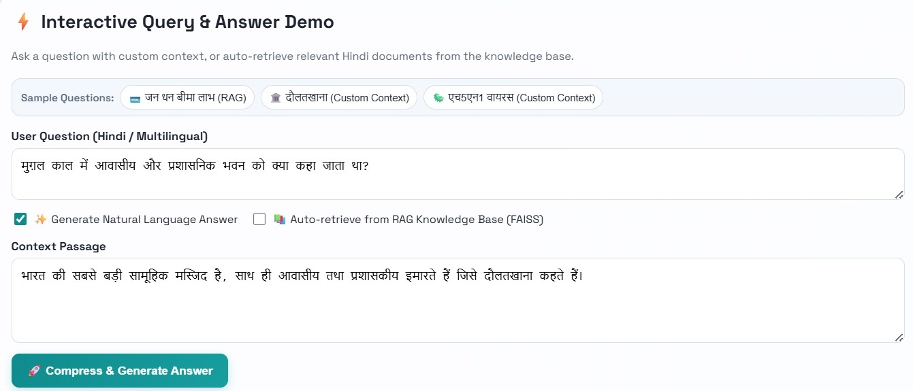

# User Guide

## Query-Aware Prompt Compressor (Hindi Question Answering)

---

## 1. Introduction

The Query-Aware Prompt Compressor is a web application that shortens a question–context pair for Hindi Question Answering tasks. Instead of rewriting the context, the application labels each token of the input as **Keep** or **Remove**, producing a compressed version of the context that retains only the information relevant to the question.

The application supports two ways of getting context for a question:

- **Custom Context** — you supply the passage yourself.
- **Retrieval-Augmented Generation (RAG)** — the application automatically retrieves relevant Hindi documents from a built-in knowledge base (using FAISS) instead of you providing the passage.

In both cases, the retrieved or supplied context is then **compressed** by the model so that only the portions relevant to your question are retained.

This guide covers how to use the application once it is running. For installation and deployment instructions, refer to the Developer Guide.

---

## 2. Accessing the Application

Open a web browser and go to the address provided by whoever set up the application. In a typical local setup, this is:

```
http://localhost:8000/
```

Notes:

- Use `localhost` or `127.0.0.1` in the browser address bar.
- If the address shown is `0.0.0.0:8000`, do not open it directly in the browser — use `localhost:8000` or `127.0.0.1:8000` instead.
- If the default port (`8000`) is unavailable, the person who runs the application may start it on a different port (for example, `8010`). In that case, use the port they provide.

---

## 3. Application Overview

The application centers on the **Interactive Query & Answer Demo**, which lets you:

- Ask a question with your own context, or
- Auto-retrieve relevant Hindi documents from a knowledge base, and
- View the **retained / compressed context** the model produces, plus an optional natural language answer.

---

## 4. Using the Interactive Query & Answer Demo



The interface includes the following elements:

| Element | Purpose |
| --- | --- |
| **User Question (Hindi / Multilingual)** | A text box where you type the question you want answered. Accepts Hindi or other languages. |
| **Generate Natural Language Answer (checkbox)** | When checked, the application also generates a plain-language answer to your question, in addition to compressing the context. |
| **Auto-retrieve from RAG Knowledge Base (FAISS) (checkbox)** | When checked, the application automatically retrieves relevant context from its built-in Hindi document knowledge base instead of requiring you to paste your own context. |
| **Context Passage** | A text box where you paste or type the Hindi passage you want compressed. This is used when auto-retrieve is not selected. |
| **Compress & Generate Answer (button)** | Submits your question (and context, if provided) to the model. |
| **Retained / Compressed Context (output area)** | Shows the compressed context after processing — the portion of the passage the model determined was relevant, with irrelevant parts removed. |

### 4.1 Submitting a Request with Your Own Context (Custom Context)

1. Type your question into the **User Question** box.
2. Paste or type the relevant passage into the **Context Passage** box.
3. Optionally, check **Generate Natural Language Answer** if you also want a direct answer, not just the compressed context.
4. Leave **Auto-retrieve from RAG Knowledge Base (FAISS)** unchecked, since you are supplying your own context.
5. Click **Compress & Generate Answer**.
6. The compressed context appears under **Retained / Compressed Context**, showing only the portions of your passage the model determined were relevant to the question.

### 4.2 Submitting a Request Using Auto-Retrieve (RAG)

1. Type your question into the **User Question** box.
2. Check **Auto-retrieve from RAG Knowledge Base (FAISS)**. This tells the application to automatically find relevant Hindi documents from its knowledge base instead of using a manually entered context.
3. Optionally, check **Generate Natural Language Answer**.
4. Click **Compress & Generate Answer**.
5. The application retrieves matching context from its knowledge base, compresses it, and displays the result under **Retained / Compressed Context**.

### 4.3 Using Sample Questions

Click any of the buttons under **Sample Questions** (for example, a question about Jan Dhan insurance benefits, Daulatkhana, or the H5N1 virus) to automatically fill in a pre-written question — and, where applicable, a matching custom context — so you can try retrieval and compression without typing your own input.

### 4.4 Understanding the Output

- **Retained / Compressed Context** — the passage (whether you supplied it or it was auto-retrieved) with only the question-relevant portions kept; unnecessary parts are removed.
- **Natural Language Answer** (if enabled) — a direct answer to your question, generated in addition to the compressed context.

### 4.5 When the Feature Is Unavailable

Compression and answer generation depend on the trained model being available on the server. If the model has not been provided by whoever set up the application, requests will fail with an error indicating the service is unavailable. If this happens, contact whoever manages your deployment to have the model made available.

---

## 5. Troubleshooting

### The page does not load

Confirm with whoever manages the application that the server is running, and confirm you are using the correct address (e.g., `http://localhost:8000/`).

### Browser shows `ERR_ADDRESS_INVALID`

You have likely opened `http://0.0.0.0:8000/`. Use `http://localhost:8000/` or `http://127.0.0.1:8000/` instead.

### Compress & Generate Answer fails or returns "unavailable"

This means the trained model is not currently available on the server. Report this to whoever manages your deployment.

---

## 6. Summary

- Use the **Interactive Query & Answer Demo** to submit a Hindi question with your own context (**Custom Context**), or auto-retrieve context from the built-in knowledge base (**RAG**).
- Click **Compress & Generate Answer** to get the **retained / compressed context**, and optionally a natural language answer.