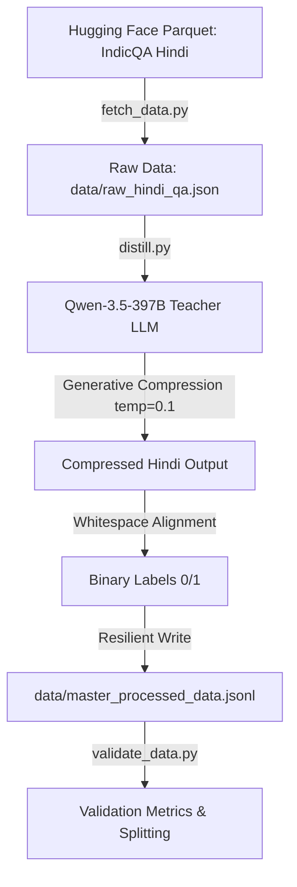

# Indic-LLMLingua: Query-Aware Hindi Prompt Compression in RAG

[](https://www.python.org/)
[](https://creativecommons.org/licenses/by/4.0/)
[](https://study.iitm.ac.in/ds/)
[]()

A deep learning project codebase for the **Data Science & AI Labs** course at **IIT Madras (Group 9)**. This repository implements **Indic-LLMLingua**, a cross-lingual query-aware token classification pipeline for context compression in Hindi Retrieval-Augmented Generation (RAG) applications.

---

## 📖 Project Objective

The primary objective of this project is to build a **Cross-Lingual Query-Aware Token Classifier** that compresses extensive prompt contexts in Hindi-based Retrieval-Augmented Generation (RAG) pipelines. 

Existing state-of-the-art prompt compressors (like LLMLingua-2) suffer from two major flaws when deployed in regional contexts:
1. **Morphological Destruction:** English-centric training results in arbitrary word fragmentation and grammatical degradation when applied zero-shot to morphologically rich Indic languages like Hindi.
2. **Task-Agnostic Information Loss:** Existing classifiers discard tokens independently of the user's question, causing catastrophic dropping of key facts required to answer the query.

By leveraging **Query-Aware Bidirectional Encoder Representations** trained on distilled regional datasets, this project ensures that context compression preserves native grammatical syntax and retains query-relevant facts.

---

## 🛠️ Methodology & Pipeline Architecture

The pipeline consists of four major sequential stages:



### 1. Data Extraction
* **Source:** The Hindi validation subset of the **AI4Bharat IndicQA** benchmark is fetched directly via Hugging Face Parquet storage.
* **Extraction:** The script [fetch_data.py](fetch_data.py) compiles context paragraphs, user questions, and ground-truth answer spans into structured context-question-answer triples saved in `data/raw_hindi_qa.json`.

### 2. LLM Distillation
* **Teacher Model:** `qwen/qwen3.5-397b-a17b` (Alibaba's frontier Mixture-of-Experts model, highly optimized for Indic scripts).
* **Execution:** Implemented in [distill.py](distill.py) (functionally the intelligent distillation script). The teacher model is queried with a low temperature of `0.1` and `top_p=0.95`. This enforces deterministic pruning, preventing the model from hallucinating or generating new synonyms and ensuring it extracts context segments verbatim.

### 3. Token Alignment Strategy
* **Generative-to-Classification Mapping:** The generative output of the Qwen teacher model must be mapped back to individual tokens in the original context.
* **Alignment Logic:** A whitespace-based tokenization strategy compares tokens in the original context to the set of tokens in the compressed text. Tokens preserved by the LLM are assigned a binary label of `1` (preserve), while dropped tokens are labeled `0` (discard).

### 4. Pipeline Resiliency & Noise Handling
To ensure uninterrupted data distillation over API endpoints, the pipeline incorporates robust fault tolerance:
* **Exponential Backoff:** If the API encounters rate-limits (HTTP 429), server timeouts, or connection failures, it sleeps for a duration of $10 \times 2^{\text{attempt}}$ seconds, retrying up to 3 times.
* **Safety Filter Protection:** Content blocked by LLM safety filters returning `None` is caught via a custom exception checker, and the row is safely skipped rather than crashing the execution.
* **Stateful Resumability:** The pipeline checks the output file (`data/master_processed_data.jsonl`) to count previously completed rows and automatically resumes from the interrupted index, protecting against data duplication and wasting API credits.

---

## 📊 Dataset & Distillation Metrics

The raw dataset sourced from AI4Bharat IndicQA (Hindi subset) contains exactly **1,052 rows**. During the distillation process, **65 rows** were skipped because the teacher LLM API returned `None` due to internal safety-filter triggers and security policies blocking the prompts. This resulted in a final dataset of **987 processed rows**.

The master dataset of 987 rows was split into training and validation sets using an 80/20 division partitioned by distinct Wikipedia articles to prevent context leakage.

| Metric | Training Set (`train_indicqa.jsonl`) | Validation Set (`val_indicqa.jsonl`) | Combined Dataset |
| :--- | :---: | :---: | :---: |
| **Total Rows** | 789 | 198 | 987 |
| **Average Context Length** | 498 tokens | 489 tokens | 496 tokens |
| **Average Compressed Length** | 19 tokens | 20 tokens | 19 tokens |
| **Compression Ratio (Reduction %)** | **96.1%** | **96.0%** | **96.1%** |
| **Answer Retention Accuracy** | **90.0%** | **91.9%** | **90.4%** |
| **Target Label Distribution (1s vs 0s)** | ~3.82% / 96.18% | ~4.09% / 95.91% | ~3.87% / 96.13% |

*Note: Answer Retention measures the percentage of rows where the exact ground-truth answer span is successfully reconstructed from the preserved (Class 1) tokens.*

---

## 🔍 Data Distillation & Token Alignment Example

To illustrate how raw query-context pairs are transformed into query-aware token classification targets, consider these actual samples from the validation split (`data/val_indicqa.jsonl`):

### Example 1:
*   **Question:** `मुग़ल काल में आवासीय और प्रशासनिक भवन को क्या कहा जाता था?` *(What were residential and administrative buildings called in the Mughal period?)*
*   **Ground-Truth Answer:** `दौलतखाना`
*   **Original Context (Sample Segment):** 
    > "... भारत की सबसे बड़ी सामूहिक मस्जिद है, साथ ही आवासीय तथा प्रशासकीय इमारते हैं जिसे दौलतखाना कहते हैं। ..."
*   **Generative compressed output (Qwen-3.5-397B):** 
    > "शाही जिसमें भारत की सबसे बड़ी सामूहिक मस्जिद है, साथ ही आवासीय तथा प्रशासकीय इमारते हैं जिसे दौलतखाना कहते हैं।"
*   **Aligned Tokens & Binary Labels:**
    *   `"आवासीय"` $\rightarrow$ **1** (Preserved)
    *   `"तथा"` $\rightarrow$ **1** (Preserved)
    *   `"प्रशासकीय"` $\rightarrow$ **1** (Preserved)
    *   `"इमारते"` $\rightarrow$ **1** (Preserved)
    *   `"हैं"` $\rightarrow$ **1** (Preserved)
    *   `"जिसे"` $\rightarrow$ **1** (Preserved)
    *   `"दौलतखाना"` $\rightarrow$ **1** (Preserved) *(Contains answer)*
    *   `"कहते"` $\rightarrow$ **1** (Preserved)
    *   `"हैं।"` $\rightarrow$ **1** (Preserved)
    *   All surrounding context describing the construction years, gardens, and Fatehpur Sikri is labeled **0** (Discarded).

### Example 2:
*   **Question:** `नाना साहब के पिता कौन थे ?` *(Who was Nana Saheb's father?)*
*   **Ground-Truth Answer:** `माधवनारायण राव`
*   **Original Context (Sample Segment):**
    > "(धोंडू पन्त) नाना साहब ने सन् 1824 में वेणुग्राम निवासी माधवनारायण राव के घर जन्म लिया था। इनके पिता पेशवा बाजीराव द्वितीय के सगोत्र भाई थे।"
*   **Generative compressed output (Qwen-3.5-397B):**
    > "नाना साहब के पिता पेशवा बाजीराव द्वितीय के सगोत्र भाई थे।"
*   **Aligned Tokens & Binary Labels:**
    *   `"नाना"` $\rightarrow$ **1** (Preserved)
    *   `"साहब"` $\rightarrow$ **1** (Preserved)
    *   `"के"` $\rightarrow$ **1** (Preserved)
    *   `"पिता"` $\rightarrow$ **1** (Preserved)
    *   `"पेशवा"` $\rightarrow$ **1** (Preserved)
    *   `"बाजीराव"` $\rightarrow$ **1** (Preserved)
    *   `"द्वितीय"` $\rightarrow$ **1** (Preserved)
    *   `"के"` $\rightarrow$ **1** (Preserved)
    *   `"सगोत्र"` $\rightarrow$ **1** (Preserved)
    *   `"भाई"` $\rightarrow$ **1** (Preserved)
    *   `"थे।"` $\rightarrow$ **1** (Preserved)
    *   The middle tokens describing the birth date `1824` and location `वेणुग्राम निवासी` are labeled **0** (Discarded).

This illustrates how the pipeline filters out general background noise while keeping the specific context span containing the information required to resolve the query.

---

## 📁 Repository Structure

```text
├── data/                 # Distilled dataset folder (tracked in git)
│   ├── README.md         # Directory conventions
│   ├── train_indicqa.jsonl # Training split (789 rows)
│   └── val_indicqa.jsonl   # Validation split (198 rows)
├── Milestone Files/      # Academic submissions
│   ├── Milestone 1/      # Problem Statement & Lit Review
│   └── Milestone 2/      # Dataset & Pipeline Report
│       └── Milestone_2_Report.md
├── worklog/              # Project contributions and peer review log
│   └── Log.md
├── .gitignore            # Git exclusion rules for weights, cache, and raw data
├── .python-version       # Local Python environment version configuration
├── distill.py            # Context compression, token alignment & distillation pipeline
├── fetch_data.py         # Hugging Face Parquet data extractor script
├── main.py               # Repository execution entrypoint
├── pyproject.toml        # PEP 621 metadata & dependencies manager
├── README.md             # Project documentation (this file)
└── validate_data.py      # Dataset validation and quality evaluator script
```

### Script Directory Reference:
*   [fetch_data.py](fetch_data.py): Fetches validation split Parquet from Hugging Face, compiles context-question-answer triples, and saves them to `data/raw_hindi_qa.json` (987 raw rows).
*   [distill.py](distill.py): Connects to the OpenAI-compatible API to prompt the Qwen-3.5 MoE model to compress context, maps generative outputs to binary sequence labels via whitespace tokenization, handles API noise, and generates the master dataset.
*   [validate_data.py](validate_data.py): Reads distilled JSONL files, validates token lengths, measures average prompt compression percentage, and calculates answer retention rates.

---

## 🚀 Getting Started

This project is configured to use [uv](https://github.com/astral-sh/uv) (a fast Python package and project manager written in Rust) but standard `pip` and `venv` are also fully supported.

### Prerequisites
* **Python >= 3.13** (specified in `pyproject.toml`)

### Option A: Setup using `uv` (Recommended)
1. **Clone the repository**:
   ```bash
   git clone https://github.com/blurrydev/Group-9-DS-and-AI-Lab-Project.git
   cd Group-9-DS-and-AI-Lab-Project
   ```
2. **Install dependencies and sync environment**:
   ```bash
   uv sync
   ```
3. **Configure environment variables**:
   Create a `.env` file in the root directory:
   ```env
   API_KEY="your-api-key"
   BASE_URL="api-endpoint-url"
   ```
4. **Execute pipeline scripts**:
   ```bash
   uv run fetch_data.py
   uv run distill.py
   uv run validate_data.py
   ```

### Option B: Setup using standard `pip` & `venv`
1. **Create and activate a virtual environment**:
   ```bash
   python -m venv .venv
   # Windows (PowerShell)
   .venv\Scripts\Activate.ps1
   # macOS/Linux
   source .venv/bin/activate
   ```
2. **Install the package in editable mode**:
   ```bash
   pip install -e .
   ```
3. **Run scripts**:
   ```bash
   python fetch_data.py
   python distill.py
   python validate_data.py
   ```

---

## 🤝 Collaboration & Contribution Guidelines

* **Model Weights:** Do **NOT** commit model weights or checkpoints (`.pt`, `.pth`, `.ckpt`, `.safetensors`). Save checkpoints locally inside `checkpoints/` or `outputs/` (configured in `.gitignore`).
* **Jupyter Notebooks:** If sharing experiment notebooks, please clear cell outputs before committing to reduce file sizes.
* **Large Datasets:** Raw files above 50 MB should be placed in `raw_data/` or `dataset/` (ignored by Git). Only distilled text datasets (JSONL format) go in the `data/` folder.
